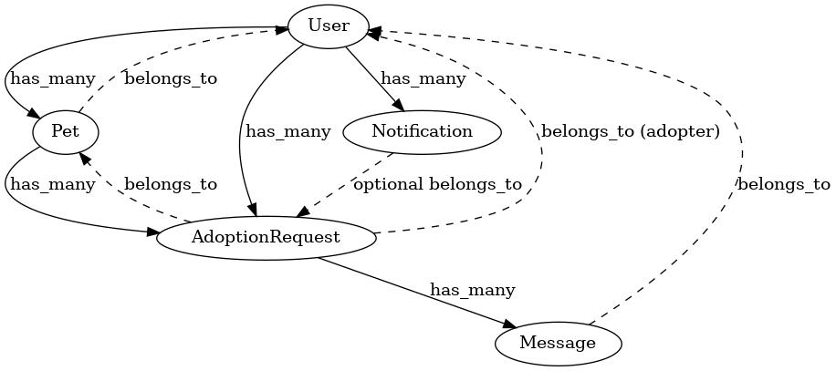

# 🏛 Architecture Overview

This document provides a high-level overview of the architecture for **StrayPawBridge**, a Ruby on Rails web application for pet adoption. It includes information about key domains, models, roles, and workflows.

## 🧩 Domains & Models

### 🐾 Pets
- **Model**: `Pet`
- **Attributes**: `name`, `species`, `size`, `status` (`available`, `pending`, `adopted`), `description`, `photos`, `location`
- **Relations**:
  - Belongs to a `User` (the rescuer)
  - Has many `AdoptionRequest`s

### 👤 Users
- **Model**: `User`
- **Attributes**: `name/email`, `encrypted password`, `role` (`user`, `admin`), `active` (soft-deactivation)
- **Roles**:
  - **User**: Can list pets, send adoption requests, and chat
  - **Admin**: Can moderate users and listings
- **Authentication**: Handled with **Devise**

### ❤️ Adoption Requests
- **Model**: `AdoptionRequest`
- **Attributes**: `message`, `status` (`pending`, `approved`, `rejected`, `cancelled`), timestamps
- **Relations**:
  - Belongs to a `Pet`
  - Belongs to a `User` (the adopter)
- **Flow**:
  1. User sends a request
  2. Rescuer approves/rejects it
  3. Upon approval, pet status becomes `pending`
  4. After contact, rescuer confirms and pet becomes `adopted`

### 💬 Messages
- **Model**: `Message`
- **Attributes**: `content`, timestamps
- **Relations**:
  - Belongs to a `User` (sender)
  - Belongs to an `AdoptionRequest`

### 🔔 Notifications
- **Model**: `Notification`
- **Attributes**: `message`, `read`, `type`
- **Relations**:
  - Belongs to a `User`
  - Optionally belongs to an `AdoptionRequest`
- Used to notify users of updates like request approval or new chat messages

## 🧠 Key Concepts

### 🔐 Authorization
- **Pundit** is used to define fine-grained policies
- Users can only update their own pets or adoption requests
- Admins can manage all data

### 🛠 Interactivity
- **Hotwire** (Turbo + Stimulus) is used for a fast, JavaScript-light experience
- Dynamic features include:
  - Updating dashboards after request changes
  - Chat without full page reloads

### 🌐 Internationalization
- i18n support for **English** and **Portuguese (pt-BR)**
- Locale stored in URL (`?locale=pt-BR`) or user preference

## 🧪 Testing

- **RSpec** is used for testing models, requests, and helpers

## 🧱 Folder Structure

```bash
app/
  models/
  controllers/
  views/
  helpers/
  policies/
  services/       
  components/     
db/
  migrate/        
config/
  locales/        
spec/
  models/
  requests/
  helpers/
  factories/
```

## Database Schema

Here’s an overview of the core entities and relationships in StrayPawBridge:




